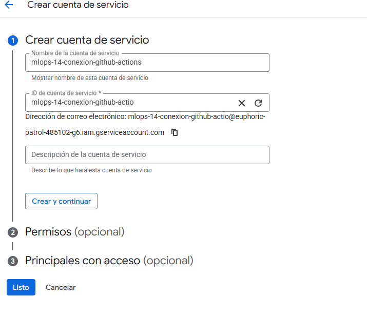
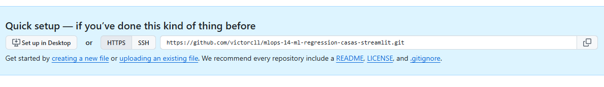
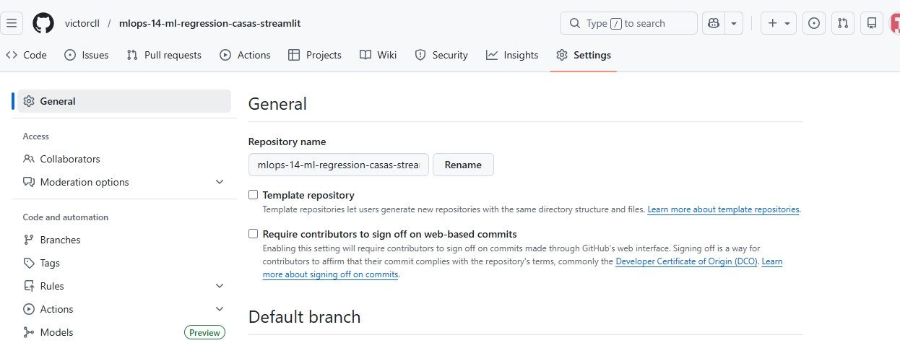
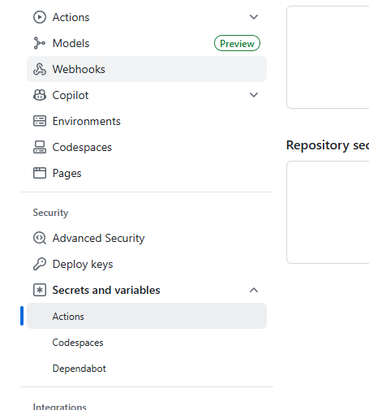
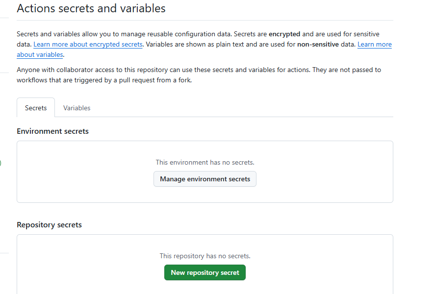
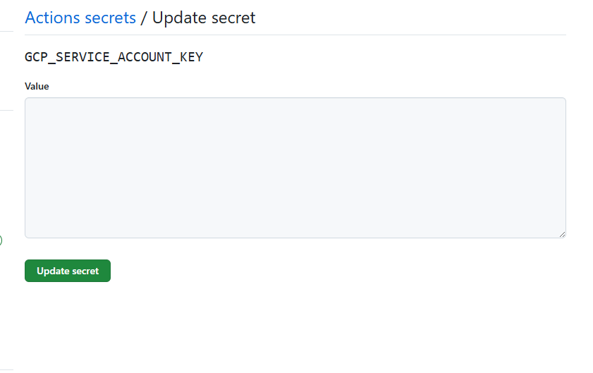

## Paso 0: Vinculación
gcloud init

## Paso 1: Creación del repositorio
gcloud artifacts repositories create repo-mlops14-streamlit-ml --repository-format docker --project euphoric-patrol-485102-g6 --location us-central1

## Paso 2: Crear el repo de github

## Paso 3: Crear la Key de la Cuenta de Servicio
## 3.1 Ingresar a google cloud platform / consola.
## 3.1 Ingresar a opcion IAM/Administracion
## 3.2 Ingresar a cuenta de servicio -> Crear cuenta de servicio 
## 3.3 Entramos a la cuenta de servicio creado -> Claves -> Crear clave nueva -> Seleccionamos JSON y nos descagara la clave

## Paso 4: Colocar el Service Account Key en GitHub Settings
## 4.1 En el repositorio creating a new file  -> luego un commit changes
## 4.2 Ingresar a Settings 
## 4.3 Ingresar a actions que se encuentra a la parte izquierda 
## 4.4 Ingreasr a new repository secret 
## 4.5 Colocar el service account key en github   y colocar el nombre que esta en cicd GCP_SERVICE_ACCOUNT_KEY

## Paso Automatizacion:
- git init
- git add .
- git commit -m "Proyecto de automatización de despliegue en GCR"
- git branch -M main
- git remote add origin https://github.com/victorcll/mlops-14-ml-regression-casas-streamlit.git
- git push -u origin main

## Cuando deseas volver a subir por algun error corres lo siguiente:
- git add .
- git commit -m "Correccion3"
- git push origin main

## Paso 4: OPCIONAL, Dar permisos de acceso a mi APLICACION. ESTO SE EJECUTA UNA SOLA VEZ
gcloud run services set-iam-policy servicio-streamlit-sesion3-kevin-inofuente gcr-service-policy.yaml --region us-central1 --project project-mlops-10-streamlit